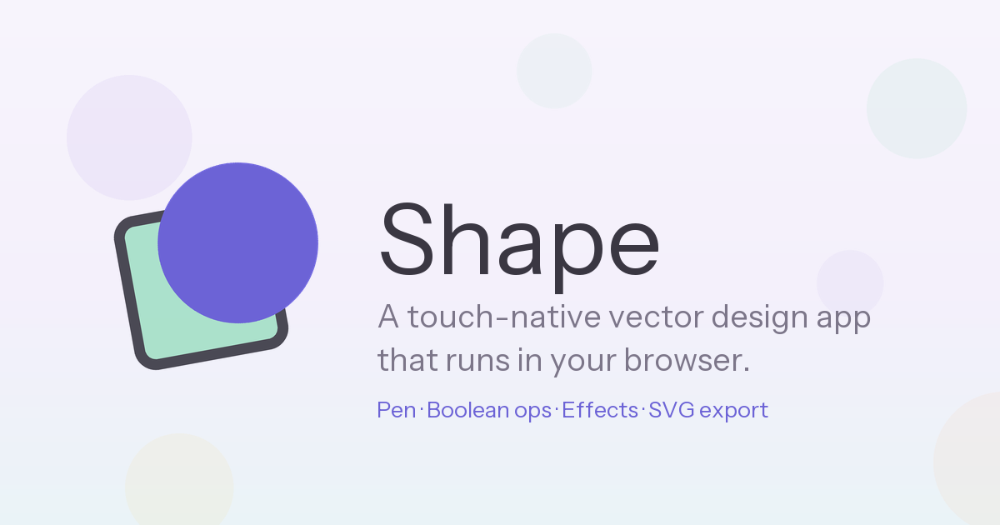

<div align="center">



# Shape

**Vector design that feels like drawing. In your browser.**

*No install. No account. No subscription.*

</div>

---

Most vector tools were built for a mouse in 1987 and grew a touch layer later.
Shape starts from the opposite end: a canvas you can actually put your hands on,
with a radial menu that comes to your thumb instead of hiding in a ribbon — and
which is just as fast under a cursor, with single-key shortcuts for everything.

It runs on a phone, a tablet, and a 32-inch monitor from the same URL.

## What's in it

**Draw properly.** A real pen tool with bezier nodes, tangent handles and
per-node corner/smooth modes. Freehand with stroke stabilisation, so a shaky
line comes out clean. Rectangles, ellipses, triangles, polygons, stars and
lines, each with live parametric controls and per-corner radius handles.

**Then push it.** Boolean pathfinder — union, minus, intersect, exclude, divide,
outline. Direct node editing. Perspective distort by dragging a corner quad.
Repeat and blend-steps for generative arrays. Masking, grouping, alignment and
distribution. Full undo history throughout.

**Make it look good.** Solid, linear-gradient, radial-gradient and pattern
fills. A whole *stack* of strokes per object — each with its own colour, width,
alignment, dash and taper profile. Drop shadow, inner shadow, outer glow, inner
glow, gaussian blur. Blend modes and per-object opacity.

**Type.** 30 bundled typefaces, variable weight, letter spacing, line height,
alignment, outline strokes — plus phonetic Hindi input that transliterates as
you type.

**Get it out.** Export to PNG at 1×–4× or SVG, either the whole project or just
what's selected — and exports are sized to what you can actually *see*,
including shadows, glows and strokes that spill past the shape. Import SVGs, or
trace a bitmap into editable vectors.

**Nothing to lose.** Projects save themselves to the browser as you work, and
`.shape` files save to disk when you want something permanent.

## Mouse and touch, equally

| | Mouse | Touch |
| --- | --- | --- |
| Zoom | Wheel, centred on the cursor | Pinch |
| Pan | Shift + wheel, or trackpad | Two-finger drag |
| Context menu | Right-click | Long-press |

Hover anything to see its shortcut. `V` select · `P` pen · `B` draw · `T` text ·
`S` shapes · `F` fill · `K` strokes · `E` effects · `A` align · `L` layers ·
`0` zoom to fit — and the usual `Ctrl` combos, all deconflicted.


## Access the hosted page in this Repo

## Run it locally

You'll need the [Flutter SDK](https://docs.flutter.dev/get-started/install)
(stable channel). That's the only prerequisite.

```bash
git clone <this-repo>
cd <this-repo>
flutter pub get
flutter run -d chrome
```

That's it — it opens in Chrome with hot reload.


**To build and serve a production copy:**

```bash
flutter build web --release
cd build/web
python -m http.server 8000     # then open http://localhost:8000
```

**To try it on your phone** over the same Wi‑Fi:

```bash
flutter run -d web-server --web-hostname 0.0.0.0 --web-port 8080
```

Then browse to `http://<your-computer's-ip>:8080` from the phone.

> Opening `build/web/index.html` by double-clicking won't work — the app fetches
> its assets over HTTP and needs a real server, even a local one.

---

<div align="center">

*by dio.stesso*

<sub>Bundled typefaces in `assets/fonts` are licensed under the SIL Open Font License.</sub>

</div>
